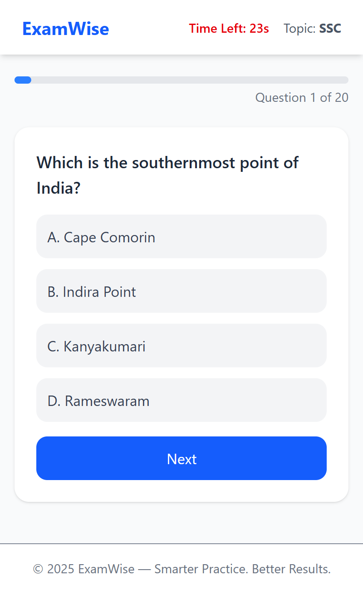

# 📘 ExamWise - Smart Exam Feedback Platform

ExamWise is a modern web application that helps students **take MCQ-based exams** and get **instant performance feedback** with **topic-wise analysis** and **study suggestions**.

Built with:
- ⚡️ Next.js (App Router)
- 🔐 Clerk Authentication
- 🧠 MongoDB (Mongoose)
- 🎨 Tailwind CSS

> "Empowering students to learn smarter, not harder."

---

## 🚀 Features

✅ One-question-at-a-time MCQ interface  
✅ 30-second timer per question  
✅ Topic-wise performance analysis  
✅ Intelligent feedback: "Topics to Focus On"  
✅ Save and retrieve past results  
✅ Secure login/signup with Clerk  
✅ Fully mobile-responsive design

---

## 🖥️ Tech Stack

| Tech           | Description                         |
|----------------|-------------------------------------|
| **Next.js**    | Full-stack React framework          |
| **MongoDB**    | NoSQL database (with Mongoose ODM)  |
| **Tailwind CSS** | Modern, utility-first styling     |
| **Clerk**      | Authentication and user management  |
| **Lucide Icons** | Beautiful icons for UI            |

---

## 📷 Screenshots

| Quiz Page                        | Result Page                        | Dashboard                        |
|----------------------------------|------------------------------------|----------------------------------|
|  |  |  |

